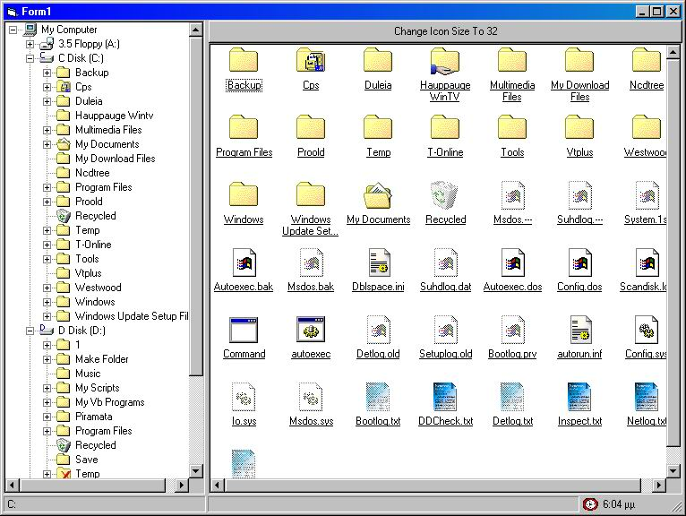



## Folder Tree Like Windows Explorer Update\(1\)

### Description

Hi All. Here is the new Version of Folder Explorer. I was been asked if I could put something for files. Include The WebBrowser control with some new Functions.

Thanks For your nice comments, are always welcome
 
### More Info
 

             |
---                |---
**Submitted On**   |2003-05-03 04:12:26
**By**             |[Toni](https://github.com/Planet-Source-Code/PSCIndex/blob/master/ByAuthor/toni.md)
**Level**          |Advanced
**User Rating**    |4.3 (26 globes from 6 users)
**Compatibility**  |VB 6\.0
**Category**       |[Files/ File Controls/ Input/ Output](https://github.com/Planet-Source-Code/PSCIndex/blob/master/ByCategory/files-file-controls-input-output__1-3.md)
**World**          |[Visual Basic](https://github.com/Planet-Source-Code/PSCIndex/blob/master/ByWorld/visual-basic.md)
**Archive File**   |[Folder\_Tre158279532003\.zip](https://github.com/Planet-Source-Code/toni-folder-tree-like-windows-explorer-update-1__1-45216/archive/master.zip)

